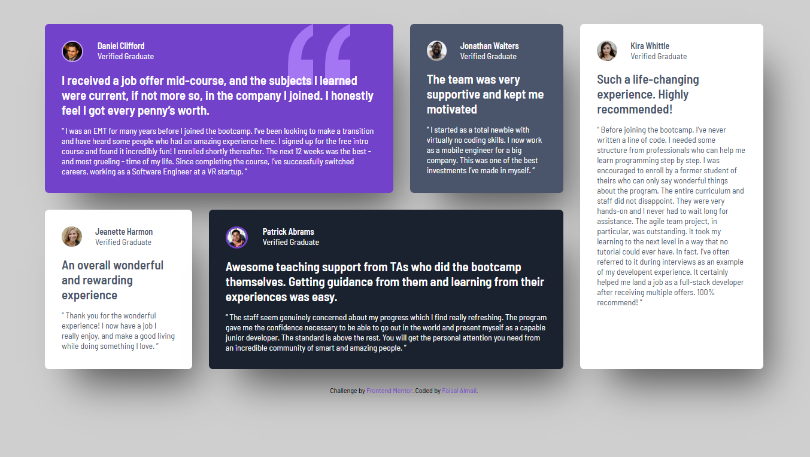

# Frontend Mentor - Testimonials grid section solution

This is a solution to the [Testimonials grid section challenge on Frontend Mentor](https://www.frontendmentor.io/challenges/testimonials-grid-section-Nnw6J7Un7). Frontend Mentor challenges help you improve your coding skills by building realistic projects. 

## Table of contents

- [Overview](#overview)
  - [The challenge](#the-challenge)
  - [Screenshot](#screenshot)
  - [Links](#links)
  - [Built with](#built-with)
  - [What I learned](#what-i-learned)
  - [Continued development](#continued-development)
- [Author](#author)

## Overview

### The challenge

Users should be able to:

- View the optimal layout for the site depending on their device's screen size

### Screenshot

### Links

- Solution URL: [https://github.com/faisalalmail/Testimonials-grid-section](https://github.com/faisalalmail/Testimonials-grid-section)
- Live Site URL: [Add live site URL here](https://your-live-site-url.com)

### Built with

- Semantic HTML5 markup
- CSS custom properties
- Flexbox
- Mobile-first workflow

### What I learned

Actual application of flexbox and grid view for different screen sizes.

In this challenge, I went a step further and created a third view to match mid size monitors, this allows the the content to be more dynamic and visually appealing on different screen sizes.

### Continued development

I guess more responsive stuff!!

**Note: Delete this note and the content within this section and replace with your own plans for continued development.**

## Author

My name is Faisal - A 35 year old guy from a small island in the middle of the world called Bahrain. I had the passion to code and practiced with html and PHP long ago. I stopped then, but the passion never died. and this could be my way to return.

- Instagram - [Faisal Almail](https://www.instagram.com/faisal.almail)
- Frontend Mentor - [@FaisalAlmail](https://www.frontendmentor.io/profile/faisalalmail)
